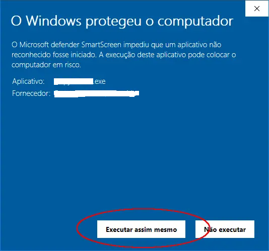

# app-status

## The application made with ElectronJs, consists of monitoring and showing some system data like memory usage, system activity (in hours) and some CPU information.

---

## APP working:

# If you want to test on your machine:

## In your machine's terminal, copy the code below:

    git clone https://github.com/anastaciom/app-status.git

---

## Enter the project folder:

    cd app-status

---

## Inside the **"app-status"** folder, install all dependencies by running:

        npm install

---

## Now let's build the app, then run:

        npm run dist

## Done, now enter the **"dist"** folder of your project and run the installer, called **"PC status Setup 1.0.0.exe"**

---

    

# Important notes:

- ## _The application has only been tested on Windows OS machines, it may not work on other OSes. :/_

---

- ## _It may happen that **Windows Defender** blocks the installation because the file is **.exe"**, just click on **"Run anyway".** and the installation will be done normally_

  

---
